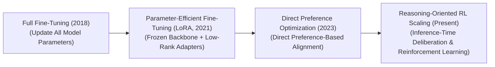
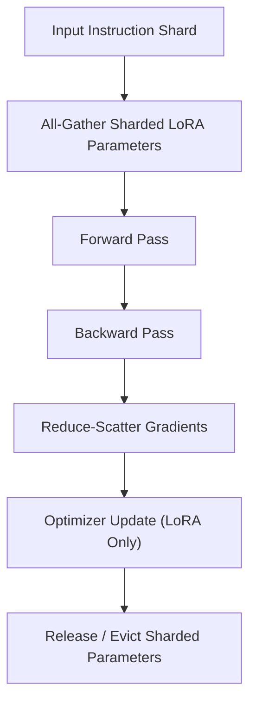

  

# 🌟 Awesome-Fine-Tuning 🚀

<!-- SEO: Awesome Fine-Tuning is a curated list of history, progression, variants, and applications of Fine-Tuning in AI -->
## 🧠 Fine-Tuning in AI: History, Progression, Variants, & Applications

**Fine-Tuning** is a hardware-aware optimization and post-training alignment paradigm in artificial intelligence that adapts a pre-trained foundation model to excel at specialized downstream tasks, domain-specific contexts, or explicit safety guardrails [INDEX: 11, 16]. In modern deep learning pipelines, models first undergo massive, self-supervised **Pre-training**, where they ingest multi-trillion token datasets or image matrices to build broad, raw statistical representations of language, vision, or logic [INDEX: 1, 10, 15]. 

Fine-tuning serves as the surgical specialization phase: by training the network over a smaller, highly curated dataset using a fraction of the initial pre-training compute, it warps the model's high-dimensional latent manifolds [INDEX: 11]. This transitions the network from a generic, unconstrained pattern-mimic into a targeted task solver, stabilizing formatting syntax, suppressing hallucinations, and enforcing compliance boundaries without forcing developers to retrain the architecture from scratch [INDEX: 11, 18].

---

## ⏳ 1. The Macro Chronological Evolution

The technical framework governing model weight adaptation has transitioned from destructive full-parameter overwrites to parameter-efficient adapters, reference-free direct preference objectives, and modern reinforcement-learned thinking loops.

| Era | Details | Year | Paper Link |
| :--- | :--- | :--- | :--- |
| [**The Full Parameter Overwrite Era (BERT / Early Transformers, ~2018–2021)**](./docs/full_parameter_overwrite.md) | **Concept:** The core foundational baseline [INDEX: 1]. Following pre-training, models were adapted by duplicating the entire neural network graph across a distributed cluster, computing backpropagation errors over a target dataset, and updating *100% of the model parameters* simultaneously [INDEX: 1].  **Limitation:** Catastrophically memory-bandwidth bound and prone to **Catastrophic Forgetting**. Modifying all weights destroyed the model's universal, zero-shot capabilities to optimize for a single, narrow feature. It also demanded immense VRAM overhead, requiring full-model checkpoint storage for every independent downstream corporate task. | 2018 | [arXiv:1810.04805](https://arxiv.org/abs/1810.04805) |
| [**The Parameter-Efficient Low-Rank Adapter Era (LoRA / QLoRA, 2021–2023)**](./docs/lora_era.md) | **Concept:** Dismantled the full-parameter memory wall by isolating learning increments into tiny parallel matrices. Popularized by Hu et al.'s **LoRA (Low-Rank Adaptation)**, it freezes the base pre-trained model weights completely. It injects a set of small, learnable low-rank decomposition rank matrices ($A$ and $B$, where rank $r \ll d_{model}$) directly alongside the self-attention projection gates, tracking updates via an auxiliary delta highway ($\Delta W = B \cdot A$).  **Significance:** Slashed VRAM hardware training requirements by over $10\times$ and checkpoint disk storage footprints by $10,000\times$, allowing a single frozen server backbone to serve dozens of custom enterprise adapters concurrently on-the-fly. | 2021 | [arXiv:2106.09685](https://arxiv.org/abs/2106.09685) |
| [**The Reparameterized Direct Preference Era (DPO, 2023–2024)**](./docs/dpo_era.md) | **Concept:** Shifted fine-tuning from flat classification text-matching to behavioral preference shaping [INDEX: 11]. Introduced by Rafailov et al., **Direct Preference Optimization (DPO)** analytically solved the reinforcement learning alignment equations under a Bradley-Terry model [INDEX: 11]. It proved that an active model's own token logits could serve implicitly as the reward estimator natively, allowing engineers to fine-tune models directly on chosen vs. rejected preference data pairs using a simple binary cross-entropy loss [INDEX: 11].  **Significance:** Fully eliminated the multi-model VRAM bottleneck of traditional PPO, making preference alignment as stable and fast as standard Supervised Fine-Tuning (SFT) [INDEX: 11]. | 2023 | [arXiv:2305.18290](https://arxiv.org/abs/2305.18290) |
| [**The Native Reinforcement-Learned Search & System 2 Era (~2024–Present)**](./docs/system2_era.md) | **Concept:** The current modern state-of-the-art foundation standard powering advanced reasoning architectures (such as OpenAI's o-series and DeepSeek-R1) [INDEX: 18, 21]. It ports fine-tuning out of static text-matching scripts and straight into large-scale **on-policy Reinforcement Learning search loops** [INDEX: 16].  **Significance:** The model is fine-tuned to generate a verbose, hidden "thinking trace" before outputting its final response [INDEX: 1]. The parameter updates are driven by deterministic verification environments (such as sandboxed code compilers) [INDEX: 17], forcing the network to internalize backtracking, error correction, and multi-step logical proving habits natively within its attention execution graphs [INDEX: 1, 16, 21]. | 2024 | [arXiv:2501.12948](https://arxiv.org/abs/2501.12948) |

---

## ⚙️ 2. Core Functional & Algorithmic Variants

Fine-Tuning methodologies are strictly categorized based on the specific parameter routing boundaries and optimization constraints they enforce over the base network layers.

| Variant | Mechanism | Year | Paper Link |
| :--- | :--- | :--- | :--- |
| [**A. Supervised Fine-Tuning (SFT / Instruction Tuning)**](./docs/sft_variant.md) | The classic entry-level post-training milestone. The model processes a highly curated dataset of instruction-response pairs (e.g., `Instruction: Translate this code to Python -> Response: [Clean Code]`), utilizing standard cross-entropy token prediction losses to align its conversational formatting syntax and persona. | 2021 | [arXiv:2109.01652](https://arxiv.org/abs/2109.01652) |
| [**B. Low-Rank Adaptation (LoRA / QLoRA)**](./docs/lora_variant.md) | Freezes base parameters, routing input feature maps concurrently through an intrinsic low-rank bypass loop. **QLoRA** modernizes this by compressing the frozen base weights down into a highly dense **4-bit NormalFloat (NF4) quantization template** [INDEX: 16], letting engineers run fine-tuning loops over multi-billion parameter foundation architectures on single, consumer-grade GPUs [INDEX: 16]. | 2021 | [arXiv:2106.09685](https://arxiv.org/abs/2106.09685) |
| [**C. Prefix / Prompt Tuning**](./docs/prefix_tuning.md) | Leaves the entire physical model weight matrix completely frozen, including attention gates. It prepends a set of small, continuous learnable continuous vector embeddings (virtual tokens) directly to the input context sequence. Backpropagation updates only these prefix vectors, letting the system learn custom tasks purely via prompt-space virtual conditioning. | 2021 | [arXiv:2101.00190](https://arxiv.org/abs/2101.00190) |
| [**D. Direct Preference Optimization (DPO Objective)**](./docs/dpo_variant.md) | Bypasses intermediate reward model network graphs [INDEX: 11]. It fine-tunes active model parameters directly using a reparameterized preference loss that measures log-likelihood ratio deltas between a chosen response ($y_w$) and a rejected response ($y_l$) natively [INDEX: 11]. | 2023 | [arXiv:2305.18290](https://arxiv.org/abs/2305.18290) |

---

## 🌐 3. The Distributed Post-Training Fine-Tuning Matrix

To specialize foundation parameters smoothly without triggering resource allocation stalls, enterprise pipelines orchestrate a multi-stage memory-sharded compilation loop [INDEX: 22].

| Strategy | Profile | Year | Paper Link |
| :--- | :--- | :--- | :--- |
| [**Fully Sharded Data Parallelism (FSDP Tuning Checkpoints)**](./docs/fsdp.md) | Slashes cluster VRAM overheads [INDEX: 22]. During large-scale fine-tuning runs, instead of replicating identical optimizer states and gradients across all distributed processes, FSDP shards parameters evenly across the entire parallel GPU array, dynamically reconstructing layer matrices via `All-Gather` primitives right before computation [INDEX: 22]. | 2020 | [arXiv:1910.02054](https://arxiv.org/abs/1910.02054) |
| [**Dynamic Data Token-Length Batch Padding**](./docs/batch_padding.md) | Memory bus balancing. Dataloaders group conversational fine-tuning scripts into blocks of equivalent token lengths, dynamically masking out empty context windows to prevent redundant zero-padding calculations from bottlenecking GPU tensor core parallelization. | 2017 | [arXiv:1706.03762](https://arxiv.org/abs/1706.03762) |

---

## 🛡️ 4. Production Engineering Challenges & Mitigations

Deploying and scaling complex fine-tuning pipelines across commercial high-performance computing setups introduces critical model drift vulnerabilities and data constraints.

| Challenge | Details | Year | Paper Link |
| :--- | :--- | :--- | :--- |
| [**The Over-alignment Saturation and Capability Collapse Wall**](./docs/capability_collapse.md) | **The Problem:** Over-optimizing a model's weights against narrow formatting rules or aggressive preference alignment guidelines can cause it to over-generalize its parameters [INDEX: 11]. The model suffers from **Alignment Tax / Capability Collapse**—a severe penalty where it loses its baseline mathematical logic, web-scale factual world knowledge, or software coding syntax thresholds because its hidden layers are forced into an overly restrictive output distribution [INDEX: 11, 16].  **Mitigation:** Implementing a strict **SFT Regularization Penalty (KL-Divergence Anchor)**, adding an explicit penalty term to the loss function that tracks the log-likelihood distance between the active tuning weights and the original frozen pre-trained reference model to halt drift boundaries safely [INDEX: 11]. | 2022 | [arXiv:2203.02155](https://arxiv.org/abs/2203.02155) |
| [**The Token Data Scarcity and Contamination Contamination Trap**](./docs/data_contamination.md) | **The Problem:** Fine-tuning models over open-source web-scraped instruction sets risks injecting **Contaminated Tokens** straight into the parameter matrix. If evaluation benchmark sets leak into the fine-tuning pool, the model will output a artificial near-perfect accuracy metric while remaining profoundly brittle and hallucination-prone on novel, un-indexed commercial edge cases.  **Mitigation:** Transitioning post-training verification loops away from static multiple-choice evaluations toward **Interactive, Sandbox-Locked Agentic Tool Execution environments (such as SWE-bench or LiveBench frameworks)**, forcing the model to pass programmatic unit tests to verify authentic capabilities [INDEX: 21]. | 2023 | [arXiv:2310.06770](https://arxiv.org/abs/2310.06770) |

---

## 🏭 5. Frontier Real-World AI Industrial Applications

| Application Area | Application Details | Year | Paper Link |
| :--- | :--- | :--- | :--- |
| [**Sovereign Enterprise Document Data Extraction & Compliance Filtering**](./docs/enterprise_extraction.md) | Deployed within legal, financial, and healthcare enclaves bound by strict data governance laws (HIPAA/GDPR). Parameter-Efficient Fine-Tuning (LoRA) adapts compact open-weight models over highly private corporate documentation repositories, training models to execute structural layout compliance audits and semantic data extraction loops safely on local server nodes. | 2023 | [arXiv:2303.17564](https://arxiv.org/abs/2303.17564) |
| [**Autonomous Software Development & Sandbox Repository Maintenance**](./docs/autonomous_software.md) | Drives automated coding platforms (such as Devin or specialized developer agents). Autoregressive transformers are instruction-tuned and reinforcement-aligned over multi-step thinking traces [INDEX: 16], conditioning the policy to treat coding tickets as a closed-loop search problem: reading file trees, generating patch code scripts, and refactoring scripts recursively until all compiler unit tests pass [INDEX: 1, 17, 21]. | 2023 | [arXiv:2310.06770](https://arxiv.org/abs/2310.06770) |
| [**High-Volume Multimodal Customer Experience & Action Frameworks**](./docs/multimodal_cx.md) | Powers intelligent consumer service networks. Autoregressive decoders undergo fine-tuning to prefer well-structured markdown formatting, charts, and bulleted summaries while heavily suppressing unstructured conversational filler tokens, ensuring real-time client streaming inputs match specific corporate backend API schemas perfectly. | 2023 | [arXiv:2303.08774](https://arxiv.org/abs/2303.08774) |

---

## 📚 References
1. Vaswani, A., et al. (2017). Attention is all you need: Scalable foundational transformer matrix blocks. *Advances in Neural Information Processing Systems (NeurIPS)* [INDEX: 1].
2. Devlin, J., et al. (2018). BERT: Pre-training of deep bidirectional transformers for language understanding. *arXiv preprint arXiv:1810.04805* [INDEX: 1].
3. Hu, E. J., et al. (2021). LoRA: Low-rank adaptation of large language models. *arXiv preprint arXiv:2106.09685* [INDEX: 11].
4. Hoffmann, J., et al. (2022). Training compute-optimal large language models: Empirical validation laws over variable data horizons. *DeepMind Chinchilla Research Monograph* [INDEX: 15].
5. Dettmers, T., et al. (2023). QLoRA: Efficient finetuning of quantized LLMs. *Advances in Neural Information Processing Systems (NeurIPS)* [INDEX: 16].
6. Rafailov, R., et al. (2023). Direct preference optimization: Your language model is secretly a reward model. *Advances in Neural Information Processing Systems (NeurIPS)* [INDEX: 11].
7. DeepSeek-AI. (2025). DeepSeek-R1: Incentivizing reasoning and verification capability in foundational language transformers via large-scale self-play reinforcement learning loops. *GitHub Repository Technical Infrastructure Manifesto* [INDEX: 16, 21].

---

To advance this documentation repository, post-training optimization setup, or MLOps automation blueprint, consider exploring these adjacent development pathways:
* Build a **Python code snippet using the Hugging Face PEFT library** illustrating how to wrap a standard pre-trained linear model layer graph inside a Low-Rank Adapter (LoRA) configuration matrix.
* Generate a **comprehensive Markdown table** explicitly comparing Full Parameter Fine-Tuning (SFT), Low-Rank Adaptation (LoRA), QLoRA 4-bit Tuning, Prefix Tuning, and Direct Preference Optimization (DPO) across computational training overhead values, GPU VRAM caching footprints, downstream disk storage sizes, risks of catastrophic forgetting, and target capability alignment velocities [INDEX: 11, 16].
* Establish an **automated performance profiling suite using Triton** to track the exact computational token-per-second throughput, communication-to-computation overlap ratios, and memory bus latency metrics achieved when compiling a fused low-rank adapter matrix update step directly inside single-pass GPU register blocks.

***

**Follow-Up Options Matrix:**

Before updating this documentation repository layout, let me know how you would like to proceed by choosing one of the options below:
* I can provide a **complete Python code boilerplate using PyTorch** demonstrating how to write a manual Supervised Fine-Tuning cross-entropy loss function that handles causal input token masking precisely.
* I can generate a **Markdown matrix table** tracking the explicit hyperparameters ($\beta$, learning rates, rank constraints, target modules) utilized by leading enterprise systems to execute post-training alignment runs [INDEX: 11].
* I can write a detailed technical explanation focusing on the **mathematical proof of Direct Preference Optimization reparameterization** and how it derives implicit reward scales straight from policy log probabilities [INDEX: 11].

