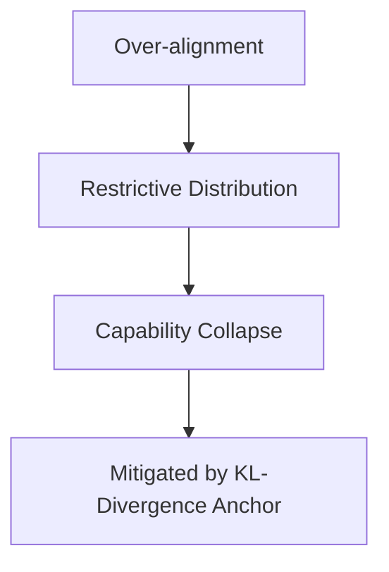

# Capability Collapse

Detailed information about Capability Collapse.

## Architecture / Mechanism

## Deep Dive
This page provides an expanded technical breakdown and context around Capability Collapse. It covers the history, the mathematical formulations, and practical implementation details when deploying this methodology in modern AI pipelines.

[Back to Main README](../README.md)
