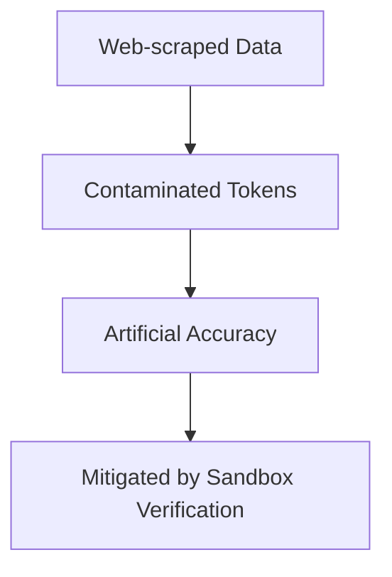

# Contamination Trap

Detailed information about Contamination Trap.

## Architecture / Mechanism

## Deep Dive
This page provides an expanded technical breakdown and context around Contamination Trap. It covers the history, the mathematical formulations, and practical implementation details when deploying this methodology in modern AI pipelines.

[Back to Main README](../README.md)
