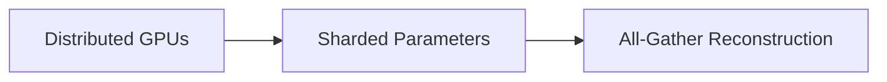

# Fully Sharded Data Parallelism

Detailed information about Fully Sharded Data Parallelism.

## Architecture / Mechanism

## Deep Dive
This page provides an expanded technical breakdown and context around Fully Sharded Data Parallelism. It covers the history, the mathematical formulations, and practical implementation details when deploying this methodology in modern AI pipelines.

[Back to Main README](../README.md)
