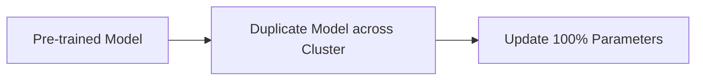

# Full Parameter Overwrite

Detailed information about Full Parameter Overwrite.

## Architecture / Mechanism

## Deep Dive
This page provides an expanded technical breakdown and context around Full Parameter Overwrite. It covers the history, the mathematical formulations, and practical implementation details when deploying this methodology in modern AI pipelines.

[Back to Main README](../README.md)
