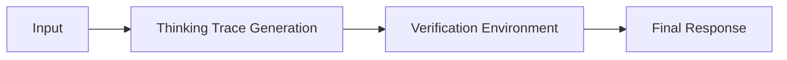

# System 2 & RL Era

Detailed information about System 2 & RL Era.

## Architecture / Mechanism

## Deep Dive
This page provides an expanded technical breakdown and context around System 2 & RL Era. It covers the history, the mathematical formulations, and practical implementation details when deploying this methodology in modern AI pipelines.

[Back to Main README](../README.md)
